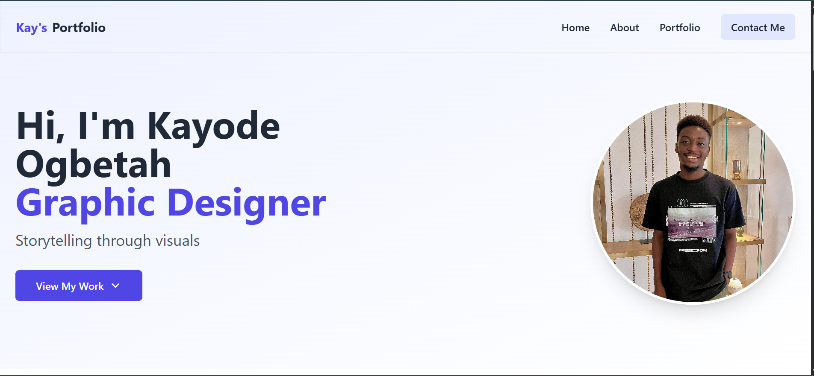
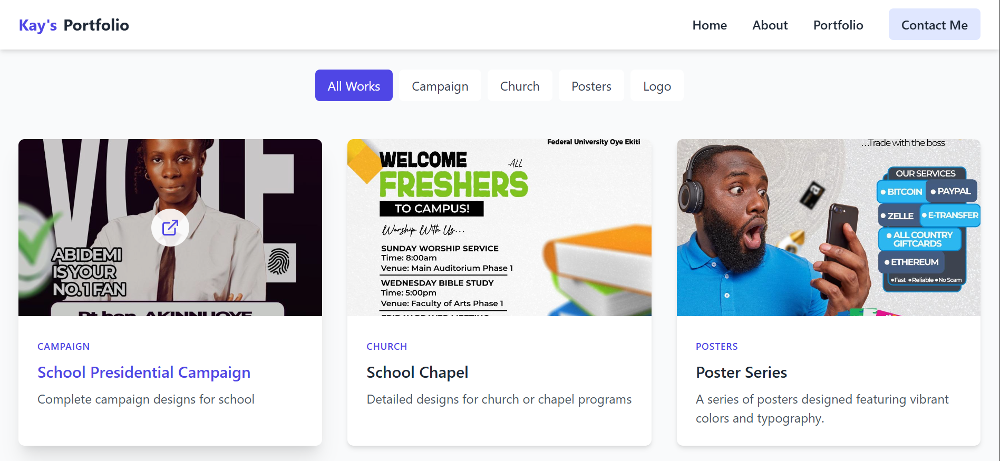
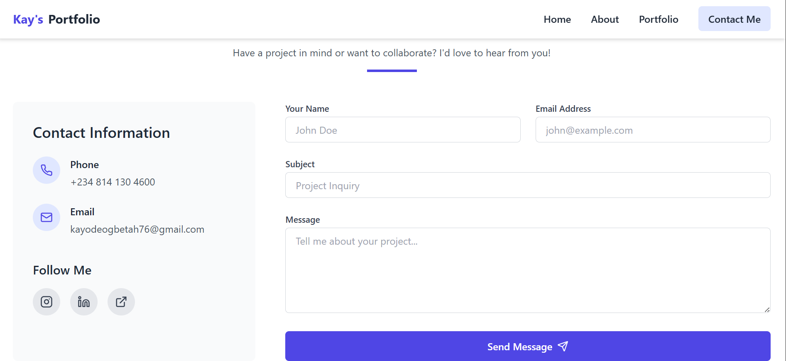

🖋️ Project Overview

Kay's Portfolio is a sleek and visually engaging portfolio website for a creative designer.
It showcases design works, about section, and a contact form, built to emphasize elegance, typography, and balance.

🚀 Features

Modern hero section with designer introduction

About section

Projects gallery grid with hover and modal previews

A contact form that sends real emails via API

Responsive layout for all screen sizes

Minimal navigation and footer

Smooth transitions

🛠️ Tech Stack

React (Vite) — fast and component-based

Tailwind CSS — responsive and customizable

Lucide Icons

Deployed on Vercel

🧱 Project Structure
src/

 ├── components/

 │   ├── Navbar.tsx

 │   ├── Hero.tsx

 │   ├── About.tsx

 │   ├── Projects.tsx

 │   └── Contact.tsx

 ├── App.tsx

 └── main.tsx

🌍 Live Demo

🔗 View on Vercel
 (Add your deployment link here)

📸 Preview

💡 Future Improvements

Add animations for page transitions

Include a CMS (like Sanity or Contentful) for project data

